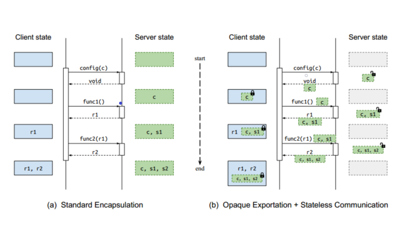

# Theseus: 一个没有状态溢出(State Spill-free)的操作系统
 
## 概要
在先前的工作中，我们已经阐述了对状态溢出这个问题不加以诊断的话，将导致实现的复杂系统难以进行升级和维护，并且无法保证他的可靠性。在这篇文章中，我们给出了Theseus操作系统的一些说明，这个操作系统的目的就在于尽可能地减少状态溢出。Theseus的灵感来自于分布式系统，这让我们重新对状态管理进行了思考，并且它很好地利用了Rust语言的一些特性来实现此功能，这些特性包括最大的安全性，代码重复利用及有效的解耦合。我们的目的在于证明Theseus是一个运行时可以组合(runtime composable)的操作系统，它是十分容易进行内部交互的，并且每个子模块在不必重新配置或重启的情况下也可以独立地进行升级更新。

## 1 介绍
如今的操作系统大多十分的庞大且复杂，它们经常包含复杂的耦合关系以至于几乎不可能实现解耦合的效果。同样地，这也让这些系统的维护升级变得更困难。这种情况随着摩尔定律的结束变得更加恶化。计算机硬件正在承受更加长的升级周期，这就需要一些革命性的进步单独出现在软件中。一个突出的例子是DARPA希望软件系统可以保持健壮性和功能性超过一百年，这其实已经远远超过了原先设计者和硬件的设计寿命。
所以，一个解耦合式的操作系统越来越受到人们的关注，在这个系统下，每个组件都将独立地向前更迭，理想情况下甚至可以实时地完成。并且不需要担心因为一个部件的一些错误危及到其他功能。

现有的操作系统的设计准则和实践让解耦合原则有了许多的测量方法。但遗憾的是，所有的这些试图解开多个部件的绑定关系的尝试都有一些缺点。首先，传统的模块化(modularization)思想是把大型的宏内核(monolithic)系统拆分成更小的，更独立，正交化的模块。基本的模块化思想在系统设备中实现了一些软件工程的目标。比如代码重复利用，但是者经常阻碍了其他的目标因为模块化导致了比较紧密的耦合。以Linux为例，这主要是因为需要大量的努力去完成升级[5, 8, 30, 41]和错误的隔离[23, 43, 44]。第二点，以封装为基础(encapsulation
-based)的解耦合策略，比如OOP，这种策略遵循的原则是将一组相关的代码和数据打包到一个简单的对象种。这种技术实现了更好的维护性和兼容性，但是具有和第一种方案同样的问题，如[15, 16, 42]所讨论的那样。第三点，特权级分离架构，就如同在微内核(microkernel)那里面实现的一样，目的是通过强制它们运行在独立地模块里面来实现分离交互关系。微内核强制把内核功能放到了用户空间服务器进程，这在较粗的空间粒度上，解决了故障隔离的问题[21]。但是系统的更迭升级仍然困难[20]因为在服务器间仍然有紧密的联系。

最近，一个硬件驱使(hardware-driven)的解耦合策略推进了传统的分布式系统，并且可以选择基于底层的硬件架构分解。如，核心(core)，相干域(coherence domains)等。单节点的机器现在已经拥有了较为宽松的耦合和异构的进程单元，这启发了一些最近的操作系统的工作如Barrelfish[10]，Helios[33]，fos[45]，和K2[29]。这些工作通过重复软件实例在多个核单独地工作让内核实现了高度可拓展的性能。虽然这些工作提高了拓展性，但是他们并没有在系统更新，实时灵活性(runtime evolution)及错误隔离方便做出更多改进。

### 我们的工作：无状态溢出
我们认为在不同的操作系统实体间的状态溢出是根本的原因，它导致了操作系统复杂的关系。状态溢出用于描述这样一个现象：一个软件的状态因为处理一个和其他实体的交互而在不停地进行改变。状态溢出简明地指出了为什么许多操作系统的目标难以实现，包括错误的隔离和容错性，实时更新系统，维护性，拓展性，进程迁移等等。我们相信状态溢出相比于解耦合来讲对于目前操作系统的挑战来说是一个更好的表达。考虑状态溢出意味着一个分离的设计比之前那些解耦合的策略的优先级更高。在这个工作里，我们介绍了Theseus，一个新的操作系统基于Rust语言。它具有独特的扁平化的软件架构和去耦策略，它的指导思想仅仅是将状态溢出清晰化。因此，在设计的每个步骤种，我们将减少状态溢出或者减轻它的影响视作最高优先级，并超过了其他所有的原则如性能，易于编程性等。Theseus的设计完全独立于底层硬件，融合了分布式系统和RESTful原理，架构集成到了单节点的操作系统中。Theseus坚持严格的设计准则，如尽可能少的状态通信，避开传统的封装措施等。

促使我们设计Theseus的主要目标是最大程度地消除状态溢出，从而使得整个操作系统实时地可以对所有组件进行重新组合，而无需重新构建或启动操作系统。这和现有的操作系统中静态的可组性不同，后者只允许在编译的过程中进行重新配置。而我们的构想是这种特性可以允许在运行Theseus的同时不断地发展以满足新的需求和用例。

我们目前关于Theseus的实现是基于Rust语言的，这是一个新兴的现代的系统编程语言，它提供了一个高度抽象的编程架构。Rust对于内存管理来说要求在编译时就确定行为，且不适用垃圾回收机制，这样它对操作系统开发来讲是十分的契合的，它强调将运行时的灵活度转移到编译时，这样符合Theseus的设计准则。我们展现了很多Rust语言的特性，比如所有权准则，这使得实现传统的操作系统的目标如隔离和新的目标如安全和解耦都更加容易。在这篇文章里，我们将分享我们一些设计和实现Theseus的经验，包括设计准则和一些主要的决策。

## 2 设计准则
Theseus的主要准则是减少状态溢出高于其他，我们这里进行简单的解释。状态溢出，意味着S->D，是一个有害的现象，状态D进行着不停地改变因为他需要处理来自S的信息交互。这里S代表资源整体(用户/调度者)，对请求进行处理和响应。状态溢出并不会在每次交互都会出现，只会在式体D的内部状态更改持续到与S的交互结束。

在本节中，我们阐述了Theseus遵循的原则以免因设计而导致状态溢出，从而实现适当的解耦合和运行时的可组合行。在一些情况下，这些设计原则可能代表了理论上的理想情况可能无法完全实现，这在第三部分进行了说明。

### 2.1 基于状态溢出解耦合实体
在Theseus运用的解耦合策略给予了减少不同实体间的状态溢出最高优先级。在考虑其他规则如易于编程性，性能，或者匹配硬件架构前，我们应首先考虑减少状态溢出。这导致了非传统的模块化原则，相比于经典的分解建议[36]，而类似于REST架构[18]。

**不封装准则**：一个实体不应为了另一个实体而提供一些港湾状态(harbor state)，即在S->D的交互后，D不应该保持交互进度的更新状态。相反，实体S应该保持这个状态，但一定不能修改它。这个原则避开传统封装以适当地分离两个实体，他们虽然进行交互，但保留了隐藏的信息（就隐蔽数据而言，并不是隐藏实施的细节[36]）。

经典的封装，规定了相关代码和数据必须一起包含在一个实体中，这通常被认为是一个很好的做法因为它会阻止对位于其他实体中的全局状态或数据的依赖。在实践中，这意味着实体运作所需的所有状态完全包含在其中，并且作为拓展，一个实体在内部存储和其他实体交互的整个过程信息。Theseus因此拒绝经典的封装，因为它会直接导致状态溢出：当客户端实体S调用服务器实体D中的一个函数，因为来自S的函数，D将不得不在内部存储一个改变状态的信息，这会导致S->D的状态溢出。

**少状态通信准则**：任何S->D的交互必须包含所有D处理这个交互所需要的数据。关于此点的逻辑拓展是D仅需要访问S传入的数据，因此可以限制D仅可访问S状态的这个状态而非其他状态。状态少的交互通信并不代表交互无任何状态，而是交互本身并不代表D的有限状态机。此处的优点在于，不必对先前的状态进行假设，这意味着实体是可以没有状态的，它并不需要储存交互之间的状态，因为未来的互动将提供足够的信息，因此状态泄露将不会发生。

### 2.2 构建解耦合操作系统
上面两个准则把重点放在成对的解耦，接下来的两个准则是关于操作系统大量实体间的复杂关系。

**通用并且少交互接口的准则**：全部实体和他们的功能应当容易访问，并且这种访问可以通过一个统一的调用，另外这中访问不需要接口的持续可用性。统一的可访问性将帮助实体增加他们的互换性并可与现有的接口与新接口平滑地集成在一起。这是受到了RESTful架构地启发，这很容易让人联想到Web介面如何允许用户浏览可用内容并临时缓存链接。

**模式重用准则**：常见的重复出现的操作系统设计技巧，如同多路复用器，间接抽象层，和调度程序，应该仅仅实现一次并且可以被操作系统重复使用。这样可以减少添加新特性与旧模式匹配的开发风险。在编译时，应该可以将已有的安全模式实例化为特定的实体，并且这种模式必须强制地没有状态溢出无论自定义参数如何。此外，所有的实体，尤其是模式，他们的范围都应该缩小，单个实体仅仅包含一项主要的功能，而不应包含多个不可分割的特征。

## 3 Theseus的设计和实现
我们现在开始描述Theseus的设计和实现，因为实现的性质影响到我们是否遵循了我们的设计准则。当然，我们目前的实现是一个用于比较和分析的操作系统，从头开始用Rust编写，我们正在将以下概念转化为无溢出的设计，他们中的大多数都未实现且受主题限制。此后，出于以下原因，我们将“实体”和“模块”互换使用。

### 3.1 扁平化的模块架构
 
图1.宏内核(a)与微内核(b)的架构，他们都具有较为复杂的模块关系，这显然让管理模块变得更加复杂，特别地，在面对状态溢出引发的纠缠中更是如此。Theseus(c)提出了一种在内核之间扁平化的设计，它的子模块必须分离成单独的和其他部件没有公用接口的模块。禁止继承式的等级减少了模块的复杂性和管理的逻辑，实现了解耦合和更好的内部交互性。 

现有的微内核和宏内核都有复杂的分层模块化的结构，其中的模块的状态可能会迁移到另一个，一个模块可能包含有其他模块作为自模块。如图1中的(a)，(b)所示。这种组合状态的溢出和模块层次结构会导致模块之间有复杂的耦合关系。相比之下，Theseus采用了一种非常规的扁平化的模块化模型，不允许所有分层模块之间有任何联系，正如图1(c)所展示的那样。因此，一个模块不能包含子模块，也不能是父模块或其他模块的子级。子模块必须执行的任务被分离成独立的第一类模块，并且包含了无溢出接口设计。这个不变量是仅和模块的结构和布局有关，与通信交互无关；任何模块都可以径直地访问其他模块地公共接口(3.4)。

此外，Theseus的变平化模型通过是能单根(root)模块，简化了模块管理。纳米核(nano-core)，直接管理系统中的每个模块。实际上，纳米核的包含范围十分有限，仅仅包含操作系统的引导程序，页表的建立，交互。尽管分层模型可能看起来更简单，但它将状态转移管理逻辑导致额外的状态到每个父模块。而这将违反通用接口的准则，因为，这种做法要求父模块核子模块区别对待，这回进一步增加模块的复杂性并阻碍互换性。
为了确保隔离，信息隐藏和互换性，每个Theseus内核模块都将实现成Rust crate的形式，然后编译成独立地二进制文件从而和其他模块分开。我们并非将所有的模块二进制文件连接到单个文件，而是将每个二进制文件打包成一个在最终的操作系统镜像中单独的文件，这样纳米核可以独立加载每个模块。因此尽可能小地Rust crate，是一个对实体来讲明确的粒度选择([12]中的3.1)并且为模块隔离和替换提供了清晰的边界。

### 3.2 不带封装的状态管理
为了保持不封装的准则，Theseus中的模块避免了传统的封装。在一个S->D的交互后，服务器端D并不存储一个和S交互的状态 ，D返回的仅是密封的表示前进到与S交互的状态，这样D内部的状态没有改变。我们将此技术称为不透明导出，因为它隐藏了信息(数据因此)，这是封装的真正好处。

 

 

图2.(a)传统的基于封装形式的模块化，这会导致客户端和服务端进行复杂的纠缠，因为对于服务端来说会出现状态溢出。(b)在Theseus里面，整个服务端的整体不透明地给客户端导出过程信息。

不透明的对外接口迫使客户端(S)维护其与服务器(D)交互的整个过程，正如图2所示的那样，这遵循了少状态通信的准则。因为在接下来唤醒D端的过程中，S端必须提供最新的关于D端的参数，所以D便可以在内部没有记录状态信息的情况下依然可以正确地进行响应。这里的灵感来自于CuriOS[16]中关于客户端状态存储的描述和RESEful网络架构中的会话cookie[13, 25]。

尽管转换了封装的形式，Theseus的代码结构比现有的类UNIX操作系统来讲，并没有很复杂或者不易于理解。在代码这一层，数据结构和类型仍然和他们相关的函数存储于一个模块中。但当运行的时候这些状态可能存在于模块之外。开发人员不必手动地导出状态或者将它们转移到其他的模块；他们被编译器抽象出来并进行管理。乍看之下，少状态通信听起来确实不错，但Theseus利用了Rust中地affne类型从而实现了零拷贝通信[9],这甚至可以发生在孤立的实体，缓存和共享映射之中。奇异性(Singularity)还利用了线性类型实现了零拷贝转移[22]，但是Theseus对于一个函数调用的通信过程来讲，甚至比奇异性通道的开销还要少。

Theseus必须应对不可避免地状态溢出，这通常发生在操作系统的抽象底层。那里的实体，比如页的分配器，中断控制器，通常需要和很多状态进行维护，这其实并非仅局限于某几个特殊的客户端。然而，这些状态必须不能阻碍实体的互换性。因此，在服务器端拥有与客户端的相关状态和无关状态的时候，我们可以讲这个实体的状态划分成两个部分：(i)状态的最小表示，这代表它不是和具体的客户端相关，它不透明地在所有客户实体之间导出数据块或者放置到指定的数据库中；(ii)这些状态只对某些客户端来说是有效的，这些状态仅表明和那些客户端进行交互的状态，显然这是由那些客户所单独占有的。我们预计，这种由两种部分的状态管理技术将会在一个实体中的状态泄露，因此可以保存操作系统的运行时的可组合性。

### 3.3 软件的安全性和隔离
Theseus利用了Rust中的内存安全的特性保障了模块之间的数据和故障隔离。它还实现了两个基于标准MMU的虚拟地址空间隔离，这有两个原因：(i)为了证明实现经典的基本的操作系统功能(如虚存的支持)的可行性及安全性；(ii)这样就不必限制其他用户程序必须用Rust或者其他安全语言来撰写了。这与相关的工作形成了鲜明的对比，后者放弃了基于硬件的隔离，因为后者需要保证在软件中必须使用安全系统语言以保证内存隔离。如SPIN[11]，Singularity[22]，以及一些最新的用Rust的作品[27, 34]。

通过三个技术，Theseus实现了模块之间的完全隔离，并且与宏内核相似有很小的开销。这三个技术是：私有的模块命名空间，这是一个Rust安全保证的变体，并且具有强制性的强大错误处理。第一，私有的名称空间可以保证模块只能访问其他的公共接口，而不是其内部的数据。这是强迫模块构建为独立的二进制文件的一大好处，他们可能无法在外部命名数据以及他们的模块范围，因为链接器将无法解析那些名字。然而尽管无法命名外部的数据，模块仍然可以通过随机的指针操作访问该数据。例如：解引用特定的地址或者重新解析类型转换，因为这些模块都共享同一个堆，就像在宏内核那里面做的那样。

第二，Theseus利用了Rust的编译器强制检查内存安全的特定从而保证了一些关于内存的危险行为。理想的解决方案是禁止所有Rust语言中unsafe的代码段；然而，Theseus不能简单的堆不安全的代码发出全面的禁止，因为许多核心功能必须要一些简短的unsafe声明才可以运作。例如I/O端口和MMIO，寄存器访问，中断配置等。这些说明并不会给模块隔离带来什么危险，但从某种意义上讲，他们可能导致处理器崩溃(此时内存安全性将不再重要)。因此，Theseus强制执行Rust的安全保证的一种变体，它通过编译器的插件允许使用这些说明，但禁止使用其他所有不安全的代码，遵循最小的特权准则。

第三，Theseus强制每个模块都可以完全处理其他模块的错误，并将错误按照统一的接口原则显示地返回给调用者。所有地公共模块接口地功能必须使用Rust地Option或Result类型以便返回错误，而不是返回一个panic。这会使得处理这些错误变得更加简单。通过禁止Rust陷入panic，Thesues防止了语言级地错误导致整个操作系统崩溃的这种情况。这是在裸机Rust环境下默认的panic行为。(请参阅第4节)

我们注意到，Theseus不能使用现有的基于语言的语言隔离机制因为他们通过不安全代码[11]的全权委托，这将仅仅隔离内核的功能需求。这种做法包括在Singularity[22]中基于软件隔离的进程，它的粒度比Theseus粗得多，并且Singularity中不能包含任何不安全的代码。其他的非软件的隔离方法，例如在单独的地址空间中运行模块的微内核[21]以及VINO的专用堆和堆栈的供应“嫁接”(模块)[40]，会导致面对数百个模块，从而难以实现目标。

### 3.4延迟，少状态的内部模块通信(Inter-Module Communication)
Theseus的内部模块通信和传统的IPC相似，但是有着不同的行为语义。每个模块将其公共功能公开为公用的接口，以允许其他的模块与其交互。接口的引用通常解析微内核空间中的本机函数调用，但如果发生在硬件隔离的实体间(例如用户空间)也可以解决RPC类型的消息传递。对其他模块的公共接口会被本地缓存为弱指针，他们可能去也可能不去解引用成真正的交互节点。他们必须升级为“强指针”以便解决这个问题。从技术上缓存这些引用可能会导致状态溢出，但这可以被安全地忽略掉，因为一个丢失或者无效的引用总是可以重新获得的。这是一个状态溢出难以消除的例子，但这个负面影响其实已经被大大消除了。

正如在3.3所提及的那样，Theseus模块都要求返回和处理错误；我们利用仅利用它来提供IMC协议(如UDP)。明确的错误处理会强制更高级别的层来确保IMC消息已经正确传递，这是一个端到端参数的应用[39]。从微服务文献[28]借用的合适的术语，IMC提供了“智能端点，但是管道很笨拙”。这与那些在编译/链接时永久绑定的系统形成对比，并且因此可以静态地保证功能的可用性。

为了促进运行时的可组合性，IMC支持接口引用的延时解析和延时自动初始化模块。其实延迟的评估一般都和Theseus的目标相契合。延时接口的解析可以使模块独立于其他的模块，从而可以任意地添加或者删除。延迟初始化每个首次访问时的模块，也为此延时初始化它所依赖的模块链。模块没有一个客户端-服务端的软件调度模块。例如：中断处理模块，可以指定初始化的例程必须由纳米核运行。

### 3.5通用的无状态泄露的操作系统模式
基于模式重用的基本原理，Theseus通过提供一个通用，安全，无状态泄露的库降低了开发的风险和繁琐的工作。我们先前的工作模式有助于解决港湾状态的问题，例如多路复用器和调度器[12]；我们己画将这些模式作为不远将来的工作重点。

Rust提供了多种优秀的语言功能，Theseus利用这些功能实现了通用的无状态泄露的模板。举个例子，Theseus可以在编译时指定通用的模式，而不会增加运行时的开销，因为Rust使用了单态化而不是类型擦除。另一个例子是Rust对高阶函数的支持和模块的灵活性，这让执行中的闭包是安全的并且是无泄漏的。

### 例子：解耦的容错队列(Decoupled, Fault-tolerant Queue)
我们通过实现DFQ来证明可重用的，无状态溢出模式的好处。使用Rust特性的MPSC队列可以在不管服务端和客户端的条件下，防止状态溢出。队列对于实体间的通信来说至关重要。例如管道，FIFO，消息队列，信号量；然而，标准队列会导致状态泄露因为服务端的数据存储在用户端中。这两个实体会有复杂的耦合关系，这样当客户端失败时，服务端就不能继续工作了。

通过利用Rust显示的所有权声名和借用的规则，DFQ通过允许每个客户保留放入队列中数据的所有权来防止状态溢出。队列本身归使用者所有，并且仅包含借用的服务端的数据引用，因此服务端之间可以进行隔离。在Rust框架下，我们增加了完善的队列特性，以及动态引用计数功能，使得排队的服务端数据可以确定是否正确处理了使用者的错误。使用者是禁止从队列中弹出数据的，并且仅仅能看到下一个数据元素尝试处理它，然后标记其为成功。这种语义完全地解放了使用者和服务端，并通过以下方式实现了容错性：(i)确认一个队列是否在预定出队前成功处理(ii)在由使用者处理后仍在队列中(iii)在使用失败后从队列丢失但可以被服务端重新加入队列。

此外，由于DFQueue是建立在无锁和少等待队列的基础上，因而它也可以在中断中安全地使用上下文。尽管我们最初未优化的DFQ实现仅实现了Rust的标准MPSC队列37％的吞吐量，但即使在键盘中断处理程序，也可以有5-110个周期是可以运作地。这些开销来自运行时参考计数，这是不可避免地，因为这保证了完成或失败的状态储存，但幸运的是这不会妨碍DFQ扩展到多个用户线程。 我们在Theseus使用DFQ的初步经验演示了为什么Rust是实现安全性，无状态溢出和通用抽象模式的最明智选择。

 

